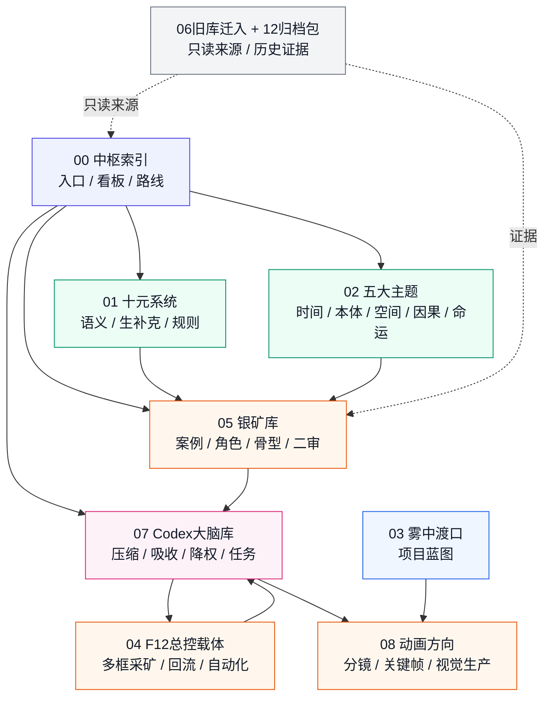
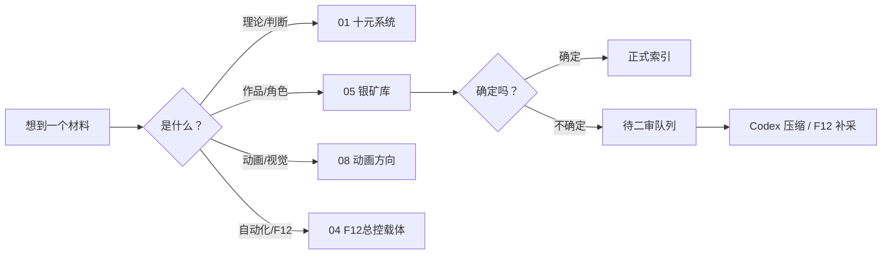
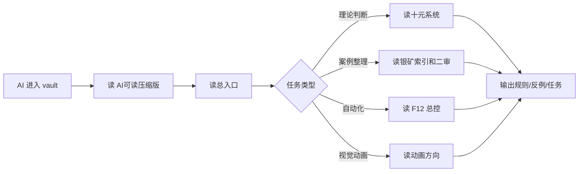

# Vault 可视化总览

> **历史快照（L6）**：本页保留 2026-05 的旧目录视图，不再是当前 AI 启动地图。当前权力等级与每小时任务只看 [[00-中枢索引/AI文件权力与任务总览|AI 文件权力与每小时任务总览]] 和 [[AI文件权力与任务总览.canvas]]。

> 文件强弱约束、关键正本和每小时任务的真实读写流，统一查看 [[00-中枢索引/AI文件权力与任务总览|AI 文件权力与每小时任务总览]] 与 [[AI文件权力与任务总览.canvas]]。本页保留全库高层视图，不负责裁决理论正本。

## 一眼看懂

## 主入口

- [[00-中枢索引/AI文件权力与任务总览|AI 文件权力与每小时任务总览]]

- [[00-中枢索引/总入口|总入口]]
- [[07-Codex大脑库/Codex大脑总入口|Codex 大脑总入口]]
- [[07-Codex大脑库/AI可读压缩版_总览|AI 可读压缩版]]
- [[07-Codex大脑库/Vault健康检查报告_2026-05-23|Vault 健康检查报告]]

## 人类使用路线

## AI 使用路线

## 分层原则

| 层 | 目录 | 看法 |
|---|---|---|
| 入口层 | `00-中枢索引` | 只指路，不堆材料 |
| 理论层 | `01-十元系统`、`02-五大主题` | 负责判断，不存大量散点 |
| 案例层 | `05-银矿库` | 存角色、作品、骨型、二审 |
| 工作流层 | `04-F12总控载体` | 存自动化与任务流程 |
| AI 脑层 | `07-Codex大脑库` | 存压缩结论、规则、任务、报告 |
| 项目层 | `03-雾中渡口`、`08-动画方向` | 存具体创作生产 |
| 归档层 | `06-旧库迁入`、`12_归档包` | 只读来源 |

## Canvas 版本

同目录有一张 Obsidian Canvas：

- [[Vault可视化总览.canvas]]

如果想拖拽、缩放、改布局，打开 Canvas；如果想让 AI 读结构，打开本页和 [[07-Codex大脑库/AI可读压缩版_总览]]。
