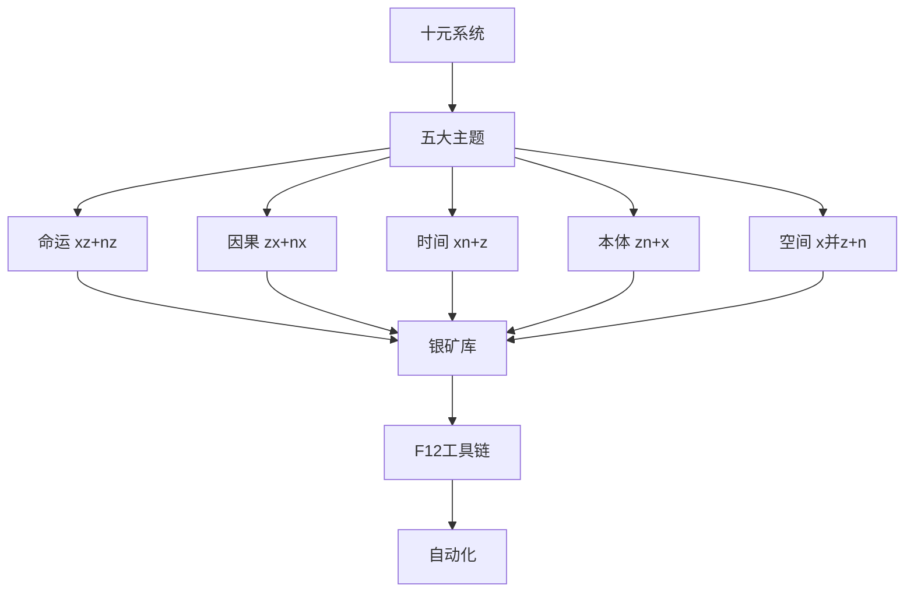

# 十元知识体系 · 总入口

> **L6 历史入口**：文件名中的“更新版”只表示 2026-05 当时的版本；当前唯一总入口是 [[00-中枢索引/总入口|总入口]]。本页不得进入 AI 启动链。

## 🗺️ Vault 导航

### 核心区域
- **[[01-十元系统]]** - 十元理论核心
- **[[02-五大主题]]** - 五大主题入口
- **[[03-对话归档]]** - 历史对话记录
- **[[04-F12总控载体]]** - 自动化工具链
- **[[05-银矿库]]** - 作品与角色素材库

### 工具入口
- **[[十元大脑插件]]** - 可视化编辑工具
- **[[F12插件]]** - 浏览器自动化工具
- **[[模板库]]** - 文档模板集合

### 索引入口
- **[[Vault可视化总览]]** - 全局视图
- **[[双库融合总入口]]** - 新旧库融合
- **[[角色库总索引]]** - 角色素材库

## 📊 五元知识体系概览

## 🚀 快速开始

### 新用户流程
1. 阅读 [[Vault可视化总览]] 了解结构
2. 学习 [[01-十元系统/三元十元语义融合总表]] 基础理论
3. 浏览 [[05-银矿库]] 查看已归档作品
4. 使用 [[模板_作品分析卡]] 创建新分析

### 贡献流程
1. 使用 F12 工具采集新作品
2. 通过 [[模板_作品分析卡]] 整理
3. 提交到 [[05-银矿库/00-待二审散点池]]
4. 等待评价后归档

---
**创建日期**: 2026-05-24
**最后更新**: 2026-05-24
**标签**: #总入口 #十元体系 #索引
