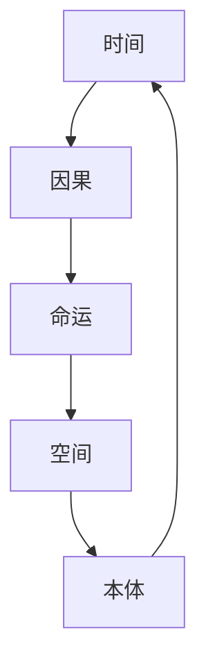

# {{作品名}} · 五元速查表

## 基本信息
- **作品类型**: {{类型}}
- **五元类型**: {{五元类型}}
- **评价分数**: {{分数}}
- **标签**: #{{五元类型}} #{{类型}}

## 五元分析表

| 维度 | 核心表现 | 十元标记 | 关键证据 |
|------|----------|----------|----------|
| 时间 | {{时间表现}} | {{时间标记}} | {{时间证据}} |
| 空间 | {{空间表现}} | {{空间标记}} | {{空间证据}} |
| 因果 | {{因果表现}} | {{因果标记}} | {{因果证据}} |
| 命运 | {{命运表现}} | {{命运标记}} | {{命运证据}} |
| 本体 | {{本体表现}} | {{本体标记}} | {{本体证据}} |

## 五元关系图

## 核心洞察

### 时间维度洞察
> {{时间洞察}}

### 空间维度洞察
> {{空间洞察}}

### 因果维度洞察
> {{因果洞察}}

### 命运维度洞察
> {{命运洞察}}

### 本体维度洞察
> {{本体洞察}}

## 与其他作品关联

- 同类型作品: [[作品A]], [[作品B]]
- 主题关联: [[作品C]], [[作品D]]

---
**创建日期**: {{date}}
**最后更新**: {{date}}
**标签**: #五元速查表 #{{五元类型}} #待归档
