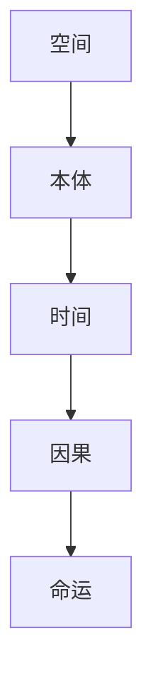

# {{作品名}} · 作品分析卡

## 基本信息
- **类型**: {{类型}}
- **十元类型**: {{十元类型}}
- **评价分数**: {{分数}}
- **标签**: #{{类型}} #{{十元类型}} #待分析

## 作品五元表

| 维度 | 核心表现 | 十元标记 |
|------|----------|----------|
| 时间 | | |
| 空间 | | |
| 因果 | | |
| 命运 | | |
| 本体 | | |

## 角色列表
- {{角色1}}
- {{角色2}}
- {{角色3}}

## 关键情节
1. 
2. 
3. 

## 核心主题
> 

## 五元关系图

---
**创建日期**: {{date}}
**最后更新**: {{date}}
**标签**: #作品分析 #{{十元类型}} #归档
