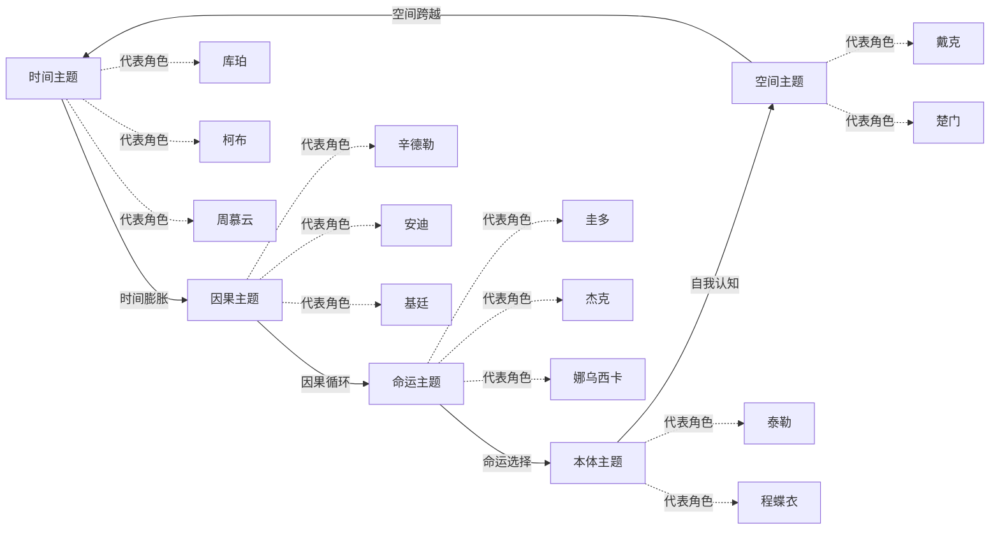

# 五元主题关系图

## 关系图谱

## 主题关联说明

### 时间主题
- **核心概念**: 时间的流逝、相对性、不可逆性
- **代表角色**: 库珀、柯布、周慕云、远野贵树、何志武
- **关键作品**: 星际穿越、盗梦空间、花样年华、秒速5厘米

### 空间主题
- **核心概念**: 空间的跨越、归属、自由与束缚
- **代表角色**: 戴克、楚门
- **关键作品**: 银翼杀手、楚门的世界

### 因果主题
- **核心概念**: 选择与后果、行动与回报、善有善报
- **代表角色**: 辛德勒、安迪、基廷、马修、麦克墨菲、爱美丽、古斯塔夫、波鲁克、琪琪、巴斯、皋月、千寻
- **关键作品**: 肖申克的救赎、辛德勒的名单、死亡诗社

### 命运主题
- **核心概念**: 命运的安排、抗争与接受、注定与选择
- **代表角色**: 圭多、杰克、娜乌西卡、哈尔、珊
- **关键作品**: 美丽人生、泰坦尼克号、风之谷

### 本体主题
- **核心概念**: 自我认知、身份认同、真实与虚幻
- **代表角色**: 泰勒、程蝶衣、戴克、楚门
- **关键作品**: 搏击俱乐部、霸王别姬、银翼杀手

---
**创建日期**: 2026-05-24
**最后更新**: 2026-05-24
**标签**: #可视化 #主题关系图 #五元分析
