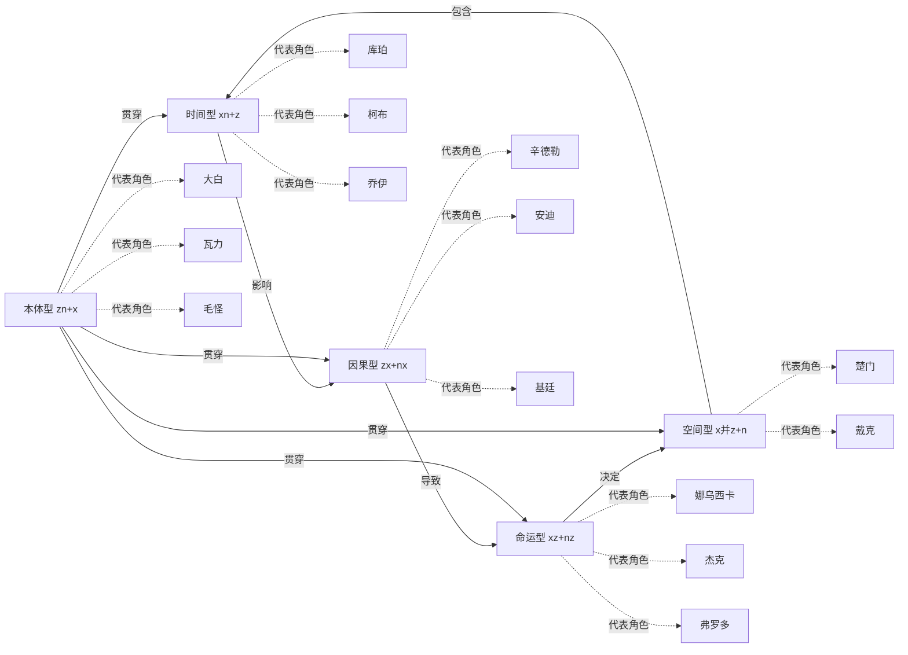

# 五元类型关系图

## 五元循环图



## 五元说明

### 时间型 (xn+z)
- **核心特征**: 关注时间的流逝、记忆、成长
- **代表角色**: 库珀、柯布、乔伊、卡尔
- **主题**: 时光、记忆、成长、遗憾

### 空间型 (x并z+n)
- **核心特征**: 关注空间的变化、归属、自由
- **代表角色**: 楚门、戴克
- **主题**: 归属、边界、跨越、探索

### 因果型 (zx+nx)
- **核心特征**: 关注选择与后果、努力与回报
- **代表角色**: 辛德勒、安迪、基廷、朱迪
- **主题**: 选择、努力、回报、救赎

### 命运型 (xz+nz)
- **核心特征**: 关注命运的安排、使命、担当
- **代表角色**: 娜乌西卡、杰克、弗罗多、瓦力
- **主题**: 使命、天赋、责任、牺牲

### 本体型 (zn+x)
- **核心特征**: 关注自我认知、本质、存在
- **代表角色**: 大白、瓦力、毛怪、乐乐
- **主题**: 自我、存在、情感、纯真

## 类型转换关系

```
时间型 + 空间型 → 因果型
因果型 + 时间型 → 命运型
命运型 + 空间型 → 时间型
本体型 + 因果型 → 命运型
本体型 + 命运型 → 时间型
```

---
**创建日期**: 2026-05-24
**最后更新**: 2026-05-24
**标签**: #可视化 #五元关系图 #知识体系
