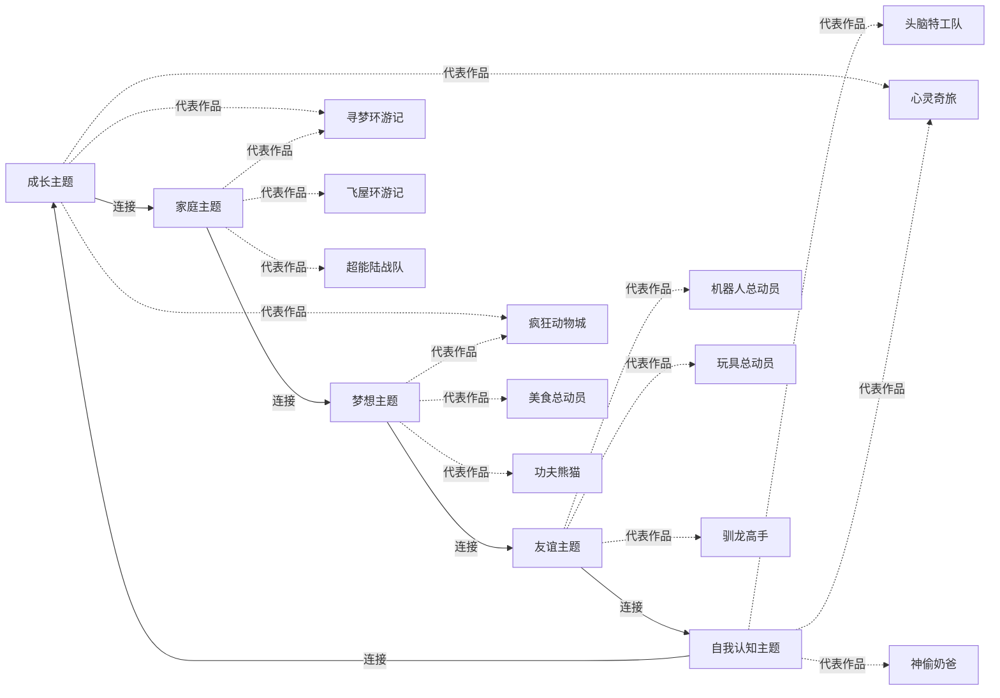

# 动画主题关系图

## 关系图谱

## 主题说明

### 成长主题
- **核心概念**: 角色从幼稚到成熟的转变过程
- **代表作品**: 疯狂动物城、寻梦环游记、心灵奇旅
- **五元关联**: 主要与因果型和时间型相关

### 家庭主题
- **核心概念**: 家庭纽带、亲情、传承
- **代表作品**: 飞屋环游记、寻梦环游记、超能陆战队
- **五元关联**: 主要与命运型和本体型相关

### 梦想主题
- **核心概念**: 追求理想、克服困难、实现目标
- **代表作品**: 疯狂动物城、美食总动员、功夫熊猫
- **五元关联**: 主要与因果型和命运型相关

### 友谊主题
- **核心概念**: 伙伴关系、相互扶持、共同成长
- **代表作品**: 机器人总动员、玩具总动员、驯龙高手
- **五元关联**: 主要与本体型相关

### 自我认知主题
- **核心概念**: 认识自我、接受自我、实现自我
- **代表作品**: 头脑特工队、心灵奇旅、神偷奶爸
- **五元关联**: 主要与本体型和时间型相关

---
**创建日期**: 2026-05-24
**最后更新**: 2026-05-24
**标签**: #可视化 #主题关系图 #动画
