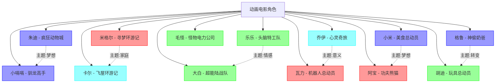

# 动画电影角色关系图

## 关系图谱

## 五元类型分布

| 五元类型 | 角色数量 | 占比 |
|---------|--------|------|
| 因果型 (zx+nx) | 5 | 38.5% |
| 命运型 (xz+nz) | 2 | 15.4% |
| 时间型 (xn+z) | 2 | 15.4% |
| 本体型 (zn+x) | 4 | 30.8% |
| 空间型 (x并z+n) | 0 | 0% |

## 主题关联

| 主题 | 相关角色 |
|------|---------|
| 梦想 | 朱迪、小嗝嗝、小米、阿宝 |
| 家庭 | 米格尔、卡尔 |
| 情感 | 乐乐、大白 |
| 意义 | 乔伊、瓦力 |
| 转变 | 格鲁、胡迪 |

---
**创建日期**: 2026-05-24
**最后更新**: 2026-05-24
**标签**: #可视化 #角色关系图 #动画电影
