# 十元知识体系总览图

## 知识体系结构

```mermaid
graph TD
    十元知识体系[十元知识体系]
    
    十元知识体系 --> 五元理论[五元理论]
    十元知识体系 --> 角色库[角色库]
    十元知识体系 --> 作品库[作品库]
    十元知识体系 --> 任务系统[任务系统]
    十元知识体系 --> 创作工具[创作工具]
    
    五元理论 --> 时间型[时间型 xn+z]
    五元理论 --> 空间型[空间型 x并z+n]
    五元理论 --> 因果型[因果型 zx+nx]
    五元理论 --> 命运型[命运型 xz+nz]
    五元理论 --> 本体型[本体型 zn+x]
    
    角色库 --> 科幻角色[科幻角色]
    角色库 --> 历史角色[历史角色]
    角色库 --> 爱情角色[爱情角色]
    角色库 --> 都市角色[都市角色]
    角色库 --> 教育角色[教育角色]
    角色库 --> 吉卜力角色[吉卜力角色]
    
    作品库 --> 经典电影[经典电影]
    作品库 --> 动画作品[动画作品]
    作品库 --> 科幻作品[科幻作品]
    
    任务系统 --> F12总控[F12总控载体]
    任务系统 --> 自动化脚本[自动化脚本]
    任务系统 --> 工作流[工作流]
    
    创作工具 --> 角色分析卡[角色分析卡]
    创作工具 --> 作品分析卡[作品分析卡]
    创作工具 --> 五元速查表[五元速查表]
    创作工具 --> 可视化工具[可视化工具]

    classDef main fill:#4A90E2,stroke:#2E5C8A,color:#fff;
    classDef sub fill:#7ED321,stroke:#5FA319,color:#fff;
    classDef item fill:#F5A623,stroke:#D68910,color:#fff;
    
    class 十元知识体系 main;
    class 五元理论,角色库,作品库,任务系统,创作工具 sub;
    class 时间型,空间型,因果型,命运型,本体型 item;
```



## 核心数据统计

| 类别 | 数量 | 说明 |
|------|------|------|
| 角色分析文档 | 25+ | 覆盖20+部作品 |
| 任务脚本 | 10+ | 包含50+个子任务 |
| 工具脚本 | 5+ | 自动化处理工具 |
| 可视化资源 | 3+ | 关系图谱和主题图 |
| 创作模板 | 4+ | 标准化创作工具 |

## 五元类型分布

```
因果型 ████████████████ 40%
命运型 ██████████ 25%
时间型 ██████████ 25%
本体型 ████ 10%
空间型   0%
```

---
**创建日期**: 2026-05-24
**最后更新**: 2026-05-24
**标签**: #可视化 #知识体系 #总览图
