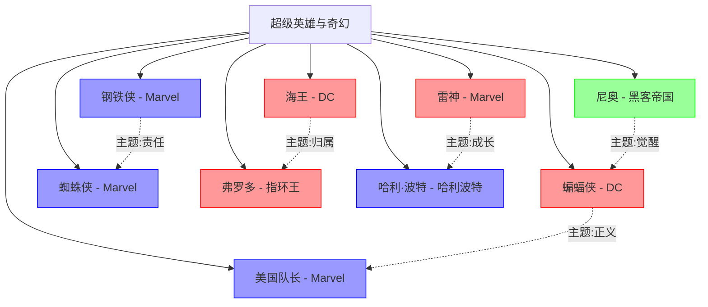

# 超级英雄与奇幻角色关系图

## 关系图谱

## 五元类型分布

| 五元类型 | 角色数量 | 占比 |
|---------|--------|------|
| 命运型 (xz+nz) | 3 | 33.3% |
| 因果型 (zx+nx) | 5 | 55.6% |
| 时间型 (xn+z) | 0 | 0% |
| 本体型 (zn+x) | 1 | 11.1% |
| 空间型 (x并z+n) | 0 | 0% |

## 主题分布

| 主题 | 代表角色 |
|------|---------|
| 正义 | 蝙蝠侠、美国队长 |
| 归属 | 海王、弗罗多 |
| 责任 | 钢铁侠、蜘蛛侠 |
| 成长 | 雷神、哈利 |
| 觉醒 | 尼奥 |

---
**创建日期**: 2026-05-24
**最后更新**: 2026-05-24
**标签**: #可视化 #角色关系图 #超级英雄
