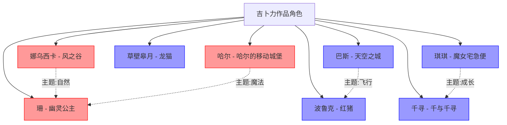

# 吉卜力角色关系图

## 关系图谱

## 五元类型分布

| 五元类型 | 角色数量 | 占比 |
|---------|--------|------|
| 因果型 (zx+nx) | 5 | 62.5% |
| 命运型 (xz+nz) | 3 | 37.5% |
| 时间型 (xn+z) | 0 | 0% |
| 本体型 (zn+x) | 0 | 0% |
| 空间型 (x并z+n) | 0 | 0% |

## 主题关联

- **自然主题**: 娜乌西卡 ↔ 珊
- **飞行主题**: 巴斯 ↔ 波鲁克
- **成长主题**: 琪琪 ↔ 千寻
- **魔法主题**: 哈尔 ↔ 珊

---
**创建日期**: 2026-05-24
**最后更新**: 2026-05-24
**标签**: #可视化 #角色关系图 #吉卜力
