# 经典电影角色关系图

## 关系图谱

```mermaid
graph TB
    科幻组[科幻电影角色]
    历史组[历史电影角色]
    爱情组[爱情电影角色]
    都市组[都市电影角色]
    教育组[教育电影角色]
    
    库珀[库珀 - 星际穿越]:::xn
    柯布[柯布 - 盗梦空间]:::xn
    戴克[戴克 - 银翼杀手]:::zn
    楚门[楚门 - 楚门的世界]:::zn
    
    辛德勒[辛德勒 - 辛德勒的名单]:::zx
    圭多[圭多 - 美丽人生]:::xz
    程蝶衣[程蝶衣 - 霸王别姬]:::xz
    维托[维托·柯里昂 - 教父]:::zx
    
    杰克[杰克 - 泰坦尼克号]:::xz
    周慕云[周慕云 - 花样年华]:::xn
    立花泷[立花泷 - 你的名字]:::xz
    远野贵树[远野贵树 - 秒速5厘米]:::xn
    
    何志武[何志武 - 重庆森林]:::xn
    爱美丽[爱美丽 - 天使爱美丽]:::zx
    古斯塔夫[古斯塔夫 - 布达佩斯大饭店]:::zx
    泰勒[泰勒 - 搏击俱乐部]:::zn
    
    麦克墨菲[麦克墨菲 - 飞越疯人院]:::zx
    基廷[基廷老师 - 死亡诗社]:::zx
    马修[马修 - 放牛班的春天]:::zx
    安迪[安迪 - 肖申克的救赎]:::zx
    
    科幻组 --> 库珀
    科幻组 --> 柯布
    科幻组 --> 戴克
    科幻组 --> 楚门
    
    历史组 --> 辛德勒
    历史组 --> 圭多
    历史组 --> 程蝶衣
    历史组 --> 维托
    
    爱情组 --> 杰克
    爱情组 --> 周慕云
    爱情组 --> 立花泷
    爱情组 --> 远野贵树
    
    都市组 --> 何志武
    都市组 --> 爱美丽
    都市组 --> 古斯塔夫
    都市组 --> 泰勒
    
    教育组 --> 麦克墨菲
    教育组 --> 基廷
    教育组 --> 马修
    教育组 --> 安迪

    classDef xz fill:#ff9999,stroke:#ff0000;
    classDef zn fill:#99ff99,stroke:#00ff00;
    classDef zx fill:#9999ff,stroke:#0000ff;
    classDef xn fill:#99ffff,stroke:#00ffff;
    classDef nx fill:#ffff99,stroke:#ffff00;
```

## 五元类型分布

| 五元类型 | 角色数量 | 占比 |
|---------|--------|------|
| 因果型 (zx+nx) | 8 | 40% |
| 命运型 (xz+nz) | 5 | 25% |
| 时间型 (xn+z) | 5 | 25% |
| 本体型 (zn+x) | 2 | 10% |
| 空间型 (x并z+n) | 0 | 0% |

---
**创建日期**: 2026-05-24
**最后更新**: 2026-05-24
**标签**: #可视化 #角色关系图 #经典电影
