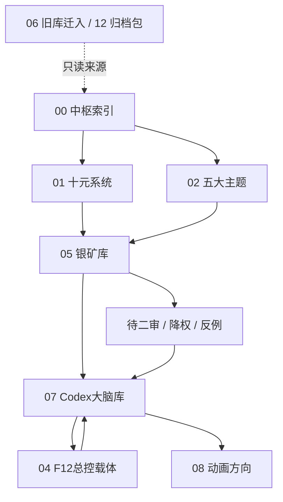

# AI 可读压缩版 总览

> **历史快照（L6）**：本页保留 2026-05 的压缩视图，不再进入 AI 启动链，也不得覆盖当前目录、任务或理论正本。当前导航请读 [[00-中枢索引/AI文件权力与任务总览|AI 文件权力与每小时任务总览]] 与 [[00-中枢索引/总入口|总入口]]。

## 读取目的

本文件给 AI 快速理解 `ten-yuan-vault`。不要把整个 vault 当普通资料库读；它是一个用于训练创作判断力的复合系统。

## 核心定义

`ten-yuan-vault` = 十元理论系统 + 五大主题归仓 + 银矿案例库 + Codex 大脑库 + F12 自动化回流 + 动画/视觉生产方向。

目标不是保存所有信息，而是把材料炼成：

- 可判断的规则
- 可复用的母型
- 可二审的案例
- 可执行的 F12 任务
- 可回流的创作资产

## 目录职责

| 目录 | AI 读取权重 | 职责 |
|---|---:|---|
| `00-中枢索引` | 高 | 全库入口、路线、索引、看板 |
| `01-十元系统` | 最高 | 十元语义、三元关系、生补克、判断规则 |
| `02-五大主题` | 高 | 时间、本体、空间、因果、命运的归仓入口 |
| `03-雾中渡口` | 中 | 项目蓝图，不作为理论源头 |
| `04-F12总控载体` | 高 | 自动化、任务、桥、断点、版本经验 |
| `05-银矿库` | 高 | 作品、角色、骨型、二审案例 |
| `05-对话归档` | 低 | 历史会话，不作为日常入口 |
| `06-旧库迁入` | 低 | 旧库来源，只读参考 |
| `07-Codex大脑库` | 最高 | 给 Codex 吸收、降权、总结、生成下一轮任务 |
| `08-动画方向` | 高 | 动画、关键帧、ComfyUI、视觉生产 |
| `12_归档包` | 低 | 归档证据，不作为当前判断入口 |
| `silver-mine` | 中低 | 旧/旁路银矿材料，需与正式银矿区区分 |

## 读取顺序

1. 先读 `00-中枢索引/总入口.md`。
2. 再读 `07-Codex大脑库/Codex大脑总入口.md`。
3. 判断理论时读 `01-十元系统/三元十元语义融合总表.md` 和 `01-十元系统/十元生补克表.md`。
4. 判断主题归仓时读 `02-五大主题`。
5. 判断案例时读 `05-银矿库`，优先看索引、角色库、二审队列。
6. 判断自动化任务时读 `04-F12总控载体` 和 `07-Codex大脑库/F12 补脑蓝图.md`。
7. 判断动画/视觉时读 `08-动画方向`。

## 判断原则

1. **先分层，再判断。**  
   不要把理论、案例、任务、归档混成同一类。

2. **先入口，后散点。**  
   所有散点都必须能回到入口、看板或二审队列。

3. **不确定就标记，不要强判。**  
   对十元类型、五大主题、评分、归仓不确定时，写 `不确定` 并放入待二审。

4. **旧库只读，正式库优先。**  
   `06-旧库迁入` 和 `12_归档包` 是来源证据，不直接覆盖当前正式判断。

5. **Codex 不吞全部原文。**  
   Codex 应优先吸收：规则、反例、二审结论、归档轮、任务建议、判断红线。

## 关键状态词

| 状态 | 含义 | AI 动作 |
|---|---|---|
| `active` | 当前有效 | 可作为入口或规则 |
| `待二审` | 需要人工确认 | 不升核心，不强判 |
| `待吸收` | 等 Codex 压缩 | 总结成规则或任务 |
| `pending-absorb` | F12/AI 回流待处理 | 进入 Codex 大脑队列 |
| `降权` | 价值下降 | 不删，进入降权清单 |
| `只读` | 归档来源 | 可引用，不改写 |

## 最小字段

新文件至少包含：

```yaml
---
type:
status:
updated:
theme:
review_status:
source:
priority:
---
```

## F12 定位

F12 不是单纯发送器，而是多框补脑管线：

```text
任务拆分 -> 多框采矿 -> 归档回流 -> Codex 压缩 -> Obsidian 更新 -> 下一轮任务
```

F12 输出优先进入：

- `07-Codex大脑库/F12归档输出`
- `07-Codex大脑库/待吸收或任务相关文件`
- 必要时再转入 `05-银矿库` 或 `08-动画方向`

## 视觉总图



## AI 输出要求

当 AI 处理本 vault 时，输出应该分四类：

1. **规则**：可复用判断句、字段规范、红线。
2. **索引**：入口、看板、队列、链接关系。
3. **任务**：给 F12 或人工二审的下一步。
4. **报告**：给用户看的压缩结论。

不要输出：

- 大段重复原文
- 未确认的理论升格
- 未经二审的评分修改
- 对旧库的物理删除建议

## 当前最优先动作

1. 建立看板总览。
2. 给银矿与角色卡补最小 YAML。
3. 把 F12 回流统一变成 `pending-absorb`。
4. 每周清一次待二审、待吸收、降权清单。
5. 让 Codex 大脑库只吸收高价值压缩结果。
