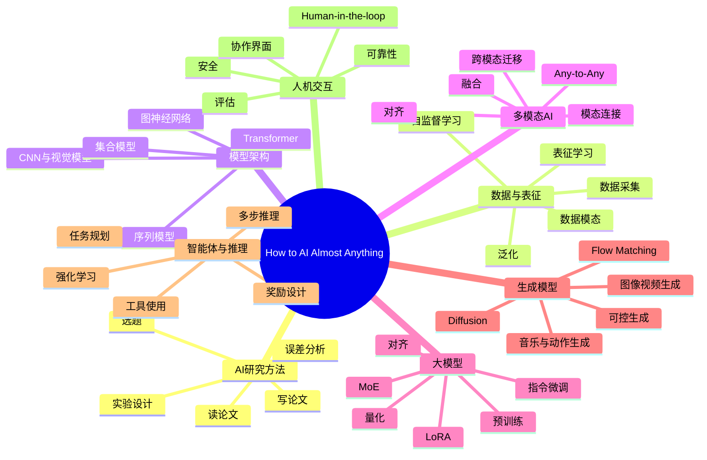
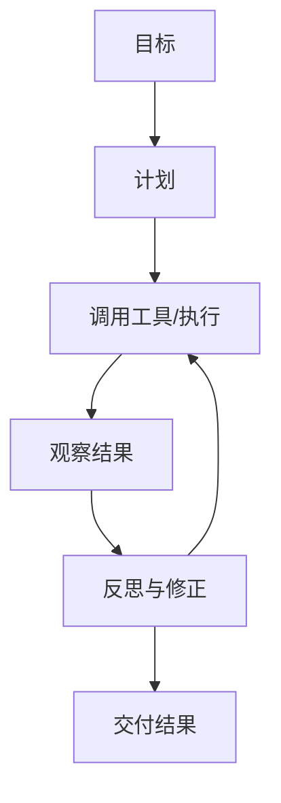

# How to AI (Almost) Anything 知识地图

这份地图不是视频逐字笔记，而是围绕《How to AI (Almost) Anything》的相关知识点做的 Obsidian 阅读入口。建议先看下面的总图，再按“学习路径”逐步展开。

## 总览地图

## 学习路径

## 1. AI研究方法

核心问题：AI 项目不是先找模型，而是先问“这个任务到底需要什么能力”。

- [[问题定义]]：任务、输入、输出、约束、成功标准。
- [[AI研究选题]]：从真实痛点、数据可得性、评价方式三个方向筛选。
- [[读论文方法]]：先抓问题、方法、实验、局限，再看公式细节。
- [[实验设计]]：基线、变量控制、消融实验、错误案例。
- [[误差分析]]：把失败样本按类型分桶，找到下一个改进方向。

阅读问题：

- 这个任务是否真的需要 AI？
- 如果不用大模型，最小可行基线是什么？
- 数据、模型、评价里，当前瓶颈是哪一个？

## 2. 数据与表征

核心问题：AI 学到的不是“世界本身”，而是数据里可被目标函数压缩出来的结构。

- [[数据模态]]：文本、图像、音频、视频、传感器、医学数据、动作、音乐、艺术。
- [[数据采集策略]]：人工标注、日志数据、合成数据、弱监督、自监督。
- [[表征学习]]：把原始输入变成可迁移、可比较、可推理的向量空间。
- [[训练目标]]：分类、预测下一个 token、对比学习、重建、偏好优化。
- [[泛化]]：训练集表现不等于真实场景表现。

关键连接：

- 数据质量影响 [[泛化]]
- 训练目标塑造 [[表征学习]]
- 模态结构决定 [[模型架构]]

## 3. 模型架构

核心问题：架构是在表达“数据有什么结构”。

- [[Transformer]]：适合序列、跨位置依赖、注意力机制，是 LLM 和很多多模态模型的底座。
- [[CNN]]：擅长局部空间结构，经典视觉模型基础。
- [[Vision Transformer]]：把图像切成 patch，用 Transformer 做视觉建模。
- [[图神经网络]]：适合关系结构，如分子、社交网络、知识图谱。
- [[Deep Sets]]：处理无序集合。
- [[时序模型]]：处理时间依赖，如语音、动作、传感器。

判断方式：

- 图像有空间结构。
- 文本有序列结构。
- 关系网络有图结构。
- 多模态任务有跨模态连接结构。

## 4. 多模态AI

核心问题：真实世界不是单一文本输入，很多任务需要模型同时理解多种信号。

- [[多模态对齐]]：让图像、文本、音频等模态在共享语义空间里相互对应。
- [[多模态融合]]：把多个模态的信息组合起来做判断。
- [[跨模态迁移]]：用一个模态学到的能力帮助另一个模态。
- [[视觉语言模型]]：图像理解、图文问答、OCR、视觉定位。
- [[Any-to-Any 模型]]：文本、图像、音频、视频之间互相输入和输出。

典型问题：

- 模型是在真正融合信息，还是只依赖其中一个模态？
- 图文对齐是语义级、对象级，还是像素/区域级？
- 多模态是否提升了任务表现，还是只增加了复杂度？

## 5. 大模型与适配

核心问题：大模型的价值不只是“参数多”，而是预训练后能被迁移到很多任务。

- [[预训练]]：在大规模数据上学习通用结构。
- [[指令微调]]：让模型理解“用户想让它做什么”。
- [[对齐]]：让模型输出更符合人类偏好、安全和任务要求。
- [[LoRA]]：低成本微调大模型的常见方法。
- [[量化]]：用更低精度降低显存和推理成本。
- [[MoE]]：混合专家模型，用稀疏激活扩大容量。

实践判断：

- 只需要提示词能否解决？
- 是否需要 RAG？
- 是否需要微调？
- 是否需要专门训练一个小模型？

## 6. 生成模型

核心问题：生成不是“凭空创造”，而是学习数据分布并按条件采样。

- [[Diffusion Models]]：从噪声逐步去噪生成图像、视频、音频等。
- [[Flow Matching]]：学习从简单分布到复杂数据分布的连续变换。
- [[可控生成]]：通过文本、图像、姿态、区域、风格等条件控制输出。
- [[视频生成]]：需要同时处理空间质量、时间一致性和物理连贯。
- [[多模态生成]]：文本到图像、图像到文本、文本到视频、文本到动作。

阅读问题：

- 控制信号是什么？
- 生成结果如何评估？
- 失败是语义错、细节错，还是时间一致性错？

## 7. 智能体与推理

核心问题：从“回答问题”走向“完成任务”，需要规划、工具使用、反馈和迭代。

- [[多步推理]]：把复杂目标拆成步骤。
- [[工具使用]]：搜索、代码、浏览器、数据库、文件系统。
- [[强化学习]]：通过奖励信号优化行为。
- [[偏好学习]]：用人类偏好引导模型输出。
- [[奖励函数风险]]：奖励设计错了，模型会学会钻空子。
- [[Agent 评估]]：不只看答案，还看过程是否稳、是否可恢复。

实践框架：

## 8. 人机交互与安全

核心问题：AI 系统最终要嵌入人的工作流，而不是只在 benchmark 上好看。

- [[Human-in-the-loop]]：人在关键节点监督、纠错、提供偏好。
- [[可靠性]]：稳定输出、可解释失败、可回滚。
- [[安全]]：越权操作、提示注入、隐私泄露、误导性输出。
- [[交互媒介]]：聊天、画布、语音、图像、视频、机器人动作。
- [[协作界面]]：让人能看见模型状态、证据、假设和不确定性。

设计问题：

- 人什么时候介入？
- 模型什么时候必须停下来确认？
- 系统如何暴露证据和不确定性？

## 推荐阅读顺序

1. [[问题定义]]
2. [[数据模态]]
3. [[表征学习]]
4. [[Transformer]]
5. [[多模态对齐]]
6. [[大模型适配]]
7. [[Diffusion Models]]
8. [[智能体与推理]]
9. [[Human-in-the-loop]]
10. [[AI系统评估]]

## 你可以怎么用这张图

- 当作视频阅读前的“地图”：先知道它会讲哪些板块。
- 当作 Obsidian MOC：把每个 `[[双链]]` 点开，逐步扩写成自己的笔记。
- 当作学习路线：每学一个节点，就补充“定义、直觉、例子、误区、代码/工具”。
- 当作项目检查表：做 AI 项目前，从问题、数据、模型、评估、安全逐项检查。

## 相关关键词索引

| 关键词 | 你应该理解什么 |
|---|---|
| Foundation Model | 大规模预训练后可迁移到多任务的模型 |
| Representation Learning | 学习有用特征，而不是手工设计特征 |
| Self-supervised Learning | 从数据自身构造监督信号 |
| Transformer | 基于注意力机制的通用架构 |
| Multimodal Alignment | 把不同模态映射到可比较的语义空间 |
| Fusion | 多个模态共同参与预测 |
| LoRA | 低秩适配微调方法 |
| Quantization | 降低数值精度以节省资源 |
| Diffusion | 逐步去噪的生成建模方法 |
| Flow Matching | 学习分布间连续变换的生成方法 |
| Agent | 能规划、调用工具、观察反馈并迭代的系统 |
| Human-in-the-loop | 人参与监督、纠偏或提供反馈的 AI 工作流 |

## 来源

- MIT OCW: [How to AI (Almost) Anything](https://ocw.mit.edu/courses/mas-s60-how-to-ai-almost-anything-spring-2025/)
- MIT course site schedule: [MAS.S60 How2AI Schedule](https://mit-mi.github.io/how2ai-course/spring2025/schedule/)

